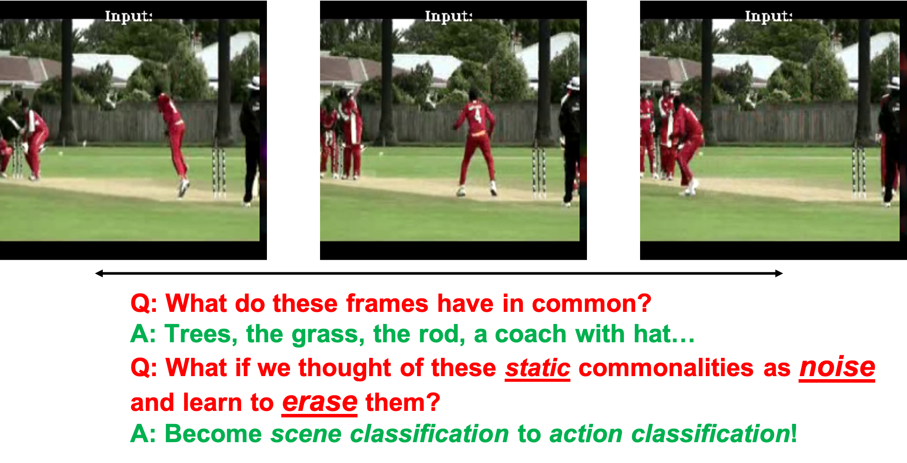
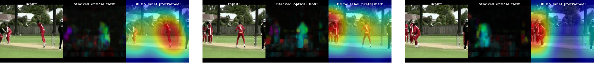
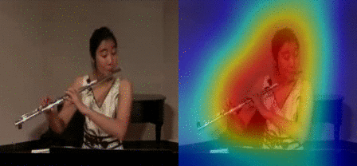
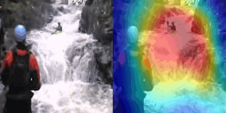

# TBE

The source code for our paper "Removing the Background by Adding the Background: Towards Background Robust Self-supervised Video Representation Learning" [[arxiv](https://arxiv.org/abs/2009.05769)]
[[code](https://github.com/FingerRec/TBE)][[Project Website]()]

<div align=center>

</div>


## Citation

```bash
@inproceedings{wang2021removing,
  title={Removing the Background by Adding the Background: Towards Background Robust Self-supervised Video Representation Learning},
  author={Wang, Jinpeng and Gao, Yuting and Li, Ke and Lin, Yiqi and Ma, Andy J and Cheng, Hao and Peng, Pai and Ji, Rongrong and Sun, Xing},
  booktitle={CVPR},
  year={2021}
}
```

## News
[2020.3.7] The first version of TBE are released!

## 0. Motivation

- In camera-fixed situation, the static background in most frames remain similar in pixel-distribution.




- We ask the model to be **temporal sensitive** rather than **static sensitive**.

- We ask model to filter the additive **Background Noise**, which means to erasing background in each frame of the video.


### Activation Map Visualization of BE



### GIF


#### More hard example


## 2. Plug BE into any self-supervised learning method in two steps

The impementaion of BE is very simple, you can implement it in two lines by python:
```python
rand_index = random.randint(t)
mixed_x[j] = (1-prob) * x + prob * x[rand_index]
```

Then, just need define a loss function like MSE:

```python
loss = MSE(F(mixed_x),F(x))
```


## 2. Installation

### Dataset Prepare
Please refer to [dataset.md] for details.

 
### Requirements
- Python3
- pytorch1.1+
- PIL
- Intel (on the fly decode)
- Skvideo.io
- Matplotlib (gradient_check)

**As Kinetics dataset is time-consuming for IO, we decode the avi/mpeg on the fly. Please refer to data/video_dataset.py for details.**

## 3. Structure
- datasets
    - list
        - hmdb51: the train/val lists of HMDB51/Actor-HMDB51
        - hmdb51_sta: the train/val lists of HMDB51_STA
        - ucf101: the train/val lists of UCF101
        - kinetics-400: the train/val lists of kinetics-400
        - diving48: the train/val lists of diving48
- experiments
    - logs: experiments record in detials, include logs and trained models
    - gradientes: 
    - visualization:
    - pretrained_model:
- src
    - Contrastive
        - data: load data
        - loss: the loss evaluate in this paper
        - model: network architectures
        - scripts: train/eval scripts
        - augmentation: detail implementation of BE augmentation
        - utils
        - feature_extract.py: feature extractor given pretrained model
        - main.py: the main function of pretrain / finetune
        - trainer.py
        - option.py
        - pt.py: BE pretrain
        - ft.py: BE finetune
     - Pretext
        - main.py the main function of pretrain / finetune
        - loss: the loss include classification loss
## 4. Run
### (1). Download dataset lists and pretrained model
A copy of both dataset lists is provided in [anonymous](). 
The Kinetics-pretrained models are provided in [anonymous]().

```bash
cd .. && mkdir datasets
mv [path_to_lists] to datasets
mkdir experiments && cd experiments
mkdir pretrained_models && logs
mv [path_to_pretrained_model] to ../experiments/pretrained_model
```

Download and extract frames of Actor-HMDB51.
```bash
wget -c  anonymous
unzip
python utils/data_process/gen_hmdb51_dir.py
python utils/data_process/gen_hmdb51_frames.py
```
### (2). Network Architecture
The network is in the folder **src/model/[].py**

|  Method   | #logits_channel  |
|  ----  | ----  | 
| C3D  | 512 |
| R2P1D  | 2048 |
| I3D | 1024 |
| R3D  | 2048 |

All the logits_channel are feed into a fc layer with 128-D output.


> For simply, we divide the source into Contrastive and Pretext, "--method pt_and_ft" means pretrain and finetune in once.

### Action Recognition
#### Random Initialization
For random initialization baseline. Just comment --weights in line 11 of ft.sh.
Like below:

```bash
#!/usr/bin/env bash
python main.py \
--method ft --arch i3d \
--ft_train_list ../datasets/lists/diving48/diving48_v2_train_no_front.txt \
--ft_val_list ../datasets/lists/diving48/diving48_v2_test_no_front.txt \
--ft_root /data1/DataSet/Diving48/rgb_frames/ \
--ft_dataset diving48 --ft_mode rgb \
--ft_lr 0.001 --ft_lr_steps 10 20 25 30 35 40 --ft_epochs 45 --ft_batch_size 4 \
--ft_data_length 64 --ft_spatial_size 224 --ft_workers 4 --ft_stride 1 --ft_dropout 0.5 \
--ft_print-freq 100 --ft_fixed 0 # \
# --ft_weights ../experiments/kinetics_contrastive.pth
```


#### BE(Contrastive)
##### Kinetics
```bash
bash scripts/kinetics/pt_and_ft.sh
```
##### UCF101
```bash
bash scripts/ucf101/ucf101.sh
```
##### Diving48
```bash
bash scripts/Diving48/diving48.sh
```


**For Triplet loss optimization and moco baseline, just modify --pt_method**

#### BE (Triplet)

```bash
--pt_method be_triplet
```

#### BE(Pretext)
```bash
bash scripts/hmdb51/i3d_pt_and_ft_flip_cls.sh
```

or

```bash
bash scripts/hmdb51/c3d_pt_and_ft_flip.sh
```

**Notice: More Training Options and ablation study can be find in scripts**


### Video Retrieve and other visualization

#### (1). Feature Extractor
As STCR can be easily extend to other video representation task, we offer the scripts to perform feature extract.
```bash
python feature_extractor.py
```

The feature will be saved as a single numpy file in the format [video_nums,features_dim] for further visualization.

#### (2). Reterival Evaluation
modify line60-line62 in reterival.py.
```bash
python reterival.py
```

## Results
### Action Recognition
#### Kinetics Pretrained (I3D)
|  Method   | UCF101  | HMDB51 | Diving48 |
|  ----  | ----  | ---- | ---- |
| Random Initialization  | 57.9 | 29.6| 17.4|
| MoCo Baseline | 70.4 | 36.3| 47.9 |
| BE  | 86.5 | 56.2| 62.6|


### Video Retrieve (HMDB51-C3D)
|  Method   | @1  | @5 | @10| @20|@50 |
|  ----  | ----  | ---- | ---- | ---- | ---- |
| BE | 10.2 | 27.6| 40.5 |56.2|76.6|

## More Visualization
### T-SNE
please refer to __utils/visualization/t_SNE_Visualization.py__ for details.

### Confusion_Matrix
please refer to __utils/visualization/confusion_matrix.py__ for details.


## Acknowledgement
This work is partly based on [UEL](https://github.com/mangye16/Unsupervised_Embedding_Learning) and  [MoCo](https://github.com/facebookresearch/moco).

## License
The code are released under the CC-BY-NC 4.0 LICENSE.